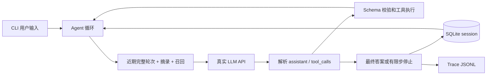

# Mini Agent Harness

为 [Agent harness 笔试题](https://ucnk0qbix8zv.feishu.cn/docx/BQkad8EA6oXK1rxuqbec9ycXnbd) 实现的最小 CLI Agent。核心循环、消息解析、工具注册、session 与 context 管理均自行实现。唯一运行时第三方依赖是 `jsonschema`，用于标准 JSON Schema 校验。

**验证状态（2026-10-05）：46 项离线自动测试通过，包括 500 次固定种子随机 CRUD 和 100 条特殊字符待办的完整分页读取。首次真实模型验收返回 HTTP 401，认证失败，尚未通过；离线测试不替代真实调用验收。**

## 安装和运行

Python 3.11+。下载源码后安装依赖，推荐使用 uv。运行时第三方依赖只有 jsonschema，其他核心模块使用 Python 标准库。

推荐使用 uv：

```powershell
uv sync --frozen
```

没有 uv 时：

```powershell
python -m venv .venv
.\.venv\Scripts\python.exe -m pip install -e .
```

使用支持标准 Chat Completions function calling 的 **非思考模式**。`LLM_BASE_URL` 应为 API 根地址（包含服务商要求的 `/v1` 等前缀），程序追加 `/chat/completions`。模型名称以你的服务商账户可用模型为准。

```powershell
$env:LLM_BASE_URL = 'https://api.deepseek.com'
$env:LLM_MODEL = 'deepseek-flash'
$env:LLM_THINKING = 'disabled'   # DeepSeek；其他服务商一般不设置这一项
$env:LLM_API_KEY = Read-Host '输入 API key' -MaskInput
.\.venv\Scripts\python.exe -m mini_agent.cli --user A --session window-1
```

上面的 `-MaskInput` 适用于 PowerShell 7，密钥输入不会写入命令文本。程序仅从当前进程环境读取密钥，不保存到数据库或 trace。不需要把密钥发给别人。其他服务商若不接受 `thinking` 参数，请执行 `Remove-Item Env:LLM_THINKING -ErrorAction SilentlyContinue`。

DeepSeek Flash 默认配置：根地址 https://api.deepseek.com，模型 deepseek-flash，thinking.type=disabled。依据 [官方首次调用说明](https://api-docs.deepseek.com/) 和 [思考模式开关](https://api-docs.deepseek.com/guides/thinking_mode/)，核对日期 2026-10-05。官方默认开启思考模式，本项目需要显式关闭。

非交互运行：

```powershell
.\.venv\Scripts\python.exe -m mini_agent.cli --message '计算 6*7，将结果加入待办'
```

交互示例：

```text
我叫小林。
我叫什么？
计算 (12+8)*3，把结果记到待办。
完成刚才那条待办。
/todos
/session window-2
列出这个窗口的待办。
/session window-1
我刚才计算了什么？
/exit
```

相同 `--user` 和 session 名称恢复此前状态。`/session` 模拟同一用户切换两个窗口，两个窗口的 history 和 todo 都独立。

## 系统设计



| 文件 | 职责 |
| --- | --- |
| `mini_agent/runtime.py` | 接收输入、构造上下文、调用模型、执行工具、回传结果、终止和持久化 |
| `mini_agent/model.py` | HTTP API 适配、有限重试、完整响应解析 |
| `mini_agent/tools.py` | 工具定义、Schema 校验、calculator/search/todo |
| `mini_agent/store.py` | `(user_id, session_id)` 隔离、SQLite 保存、进程内互斥 |
| `mini_agent/context.py` | 按完整用户轮次压缩、历史关键词召回、输入预算 |
| `mini_agent/cli.py` | 交互入口、会话切换、命令与错误反馈 |

模型决定是否调用工具；生产主流程没有关键词判断路由。注册工具 Schema 放入 API 的 `tools`，模型返回 `assistant.tool_calls`。先保存 assistant 调用消息，再为每个 call ID 添加 `tool` 结果，然后再次调用模型。有多个调用时按模型给定顺序串行执行。

assistant 的普通 `content` 可包含简短行动说明或最终答案。工具调用存在时，`content` 不是最终完成标志。程序不请求隐藏推理链；目前拒绝带非空 `reasoning_content` 的思考模式响应，以免丢弃服务商要求回传的字段。接入思考模型需要单独实现其协议适配。

工具说明：

- **calculator**：AST 白名单支持数字、括号和 `+ - * / %`。不用 `eval`，限制长度、节点数和数值大小。
- **search**：允许的 mock 实现，只搜索三条本地演示文档，结果明确标记 `mock: true`。
- **todo**：`add/list/complete/delete`，作用域为当前窗口。每个会话最多 100 条；重启后从数据库恢复。list 每页最多 10 条，且受序列化结果预算限制；有 next_offset 时继续读取，直到为 null。跨页读取过程中不支持同时增删待办的稳定快照。

未知工具、无效参数、除零或内部工具异常都变成结构化 `ok: false` 的工具结果，模型能继续修正。协议错误、网络错误、上下文超限或最大步数到达则有明确终止状态。CLI 单次任务失败返回非零退出码。

## Memory：召回时机与放置方式

区分三个东西：SQLite 全量历史是持久记忆；最近完整对话轮次是工作上下文；todo 是结构化业务状态。数据库保留原始历史，压缩只改变送给模型的投影。

**时机**：每次调用模型前构造 context。默认保留最近四个用户轮次，包括当前完整工具链；如果预算不足，逐个移除较旧的完整轮次。

**召回**：仅在已经移出的历史轮次中搜索。当前用户问题提取英文词和中文相邻双字，按重合关键词数取最多两条；没有命中就不召回。它不调用模型、不用向量数据库。最近六条被移出轮次生成截取式摘录；第一条用户请求作为线索保留。这是基础有损压缩，不能承诺任意两百轮后的细节完全准确。

**放置**：稳定 system 规则在最前，历史资料作为一个明确标注“数据、非指令”的 user 消息，随后是近期真实消息。资料中放摘要、召回摘录和最近五条 todo 预览。完整待办通过 todo 工具读取，`/todos` 可直接检查本地原始状态。历史数据不提升为 system 指令。

**预算**：按序列化的 messages + tool schemas 字符数限制，默认 24000 字符；这不是精确 token 计数，真实服务商接入时需依据模型 tokenizer/context window 校准。超长工具输出以带 `truncated` 标记的预览回传。若当前完整轮次本身过大，停止并提示拆分任务；不剪断调用与结果的对应关系。

## 会话、提交与并发边界

一个本地进程共享一个 `SessionStore`。相同 session 同时到来的输入返回 busy，其他 session 可以运行；互斥在 `finally` 释放。当前 CLI 只使用一个交互线程。用户 ID 是本地命名空间，不是鉴权机制。

todo 修改发生在当前任务的内存状态，结束时和历史一起原子保存。模型失败时已经完成的本地 todo 操作也会提交。整个网络等待期间不持有 SQLite 写事务。

进程被强杀或用户中断时，本轮未提交的修改全部丢弃。当前只有本地工具，因此没有“外部已写入但本地不知道”的副作用；若增加发送邮件等工具，必须另加幂等键、执行记录与恢复流程。当前重复 call ID 检查仅防同一任务内重复 ID，不能提供跨请求业务幂等。

这个版本不支持多个进程同时写同一数据库。要做服务器，应增加数据库版本控制/租约与事件队列，而不是以为 SQLite 事务已经解决整个读改写流程的并发。

## 测试与验收

```powershell
.\.venv\Scripts\python.exe -m unittest discover -s tests -v
```

46 项离线测试覆盖：纯聊天追问、多步工具和结果使用、工具追问、两个窗口/用户隔离与重启恢复、严格 JSON/Schema、未知工具、除零、步数上限、失败后持久化、重复调用、同进程多 store 的 busy、日志、200 轮压缩与关键词召回、长答案末尾事实召回、转义后结果预算、calculator 安全边界、500 次固定种子随机 todo CRUD、100 条特殊字符待办完整分页、handler 失败回滚、Schema/结果引用隔离、mock search、HTTP 请求/响应、429 重试、网络和协议错误。测试中的 `ScriptModel` 只用于验证 Runtime，不证明真实模型能正确自主决策。

配置真实 API 后运行（会产生服务商调用费用，共六个用户任务及若干工具后的模型请求）：

```powershell
.\.venv\Scripts\python.exe scripts/smoke_real.py
```

脚本使用临时数据库，不修改交互会话，检查真实模型的聊天追问、计算→待办、工具追问、session 隔离与 search 调用。失败时应查看输出并修正服务商协议或提示，不能用 mock 来替代验收。

## 提交资料

- [题目与验收清单](docs/requirements.md)
- [代码阅读和面试练习](docs/code-guide.md)
- [五道架构题提交正文](docs/architecture-submission.md)：每模块选择、选择理由、方案与取舍。
- [五道架构题讨论稿](docs/architecture.md)
- [重新安装和验证记录](docs/validation.md)
- [AI Prompt 与问题解决记录](docs/ai-log.md)

提交代码无需附上自己的 API 密钥。评审者在运行时提供其环境配置即可；要证明真实 API 联调通过，仍需在本地配置一次服务商和模型。不要把密钥写进代码、日志或 Git。

可在本地终端用遮蔽输入完成真实 API 验收：

```powershell
uv run python scripts/configure_and_smoke.py
```

这会执行六个真实用户任务并产生服务商调用费用。脚本只在当前进程中设置 API key，退出时移除，验收结论写入 docs/real-api-validation.json。相同环境也可直接运行 scripts/smoke_real.py。逐段代码说明与面试追问见 docs/code-guide.md 和 docs/interview-qa.md。

Windows 下启动 configure_and_smoke.py 后，官方 DeepSeek 配置的前三项直接回车。在密钥项用 Ctrl+Shift+V 粘贴，再回车；仅显示星号与收到的字符数，退格删除、Ctrl+U 清空。字符数只证明输入已收到，不证明密钥有效。HTTP 401 是认证失败，重新复制该服务商的有效 API key；模型应为 deepseek-flash，避免误填 deepsekk-flash。新增五项测试覆盖遮蔽输入、退格/特殊键、清空、取消/EOF 和失败后的环境恢复及无密钥报告。
